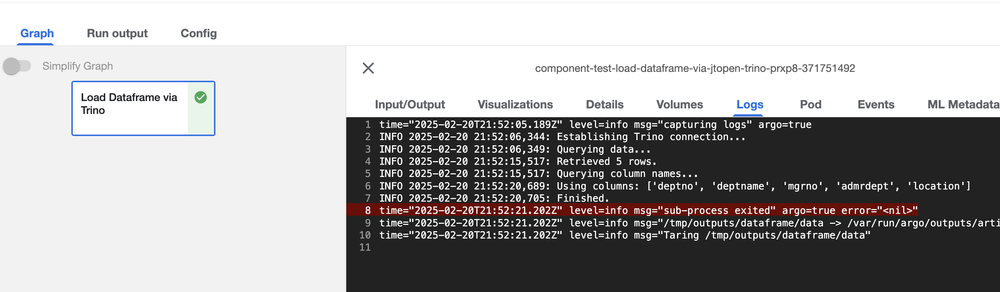

In this doc, we will cover how to access Db2 for i from Rocket AI Hub. To do this, we will create a Kubeflow Pipeline that reads data from Db2 for i, using a Trino Connector and Mapepire.


## Configure Db2 for i Trino Connector

Before we build a pipeline that reads in data from db2 for i, let's first connect to the Db2 for i database from a Kubeflow Notebook Server using the Trino Python SDK. In order to do this, we need to configure the Trino Connector for Db2 for i.  
Here we assume that a Trino instance is already installed in the OpenShift cluster. If you haven’t installed it yet, please refer to the instructions in this [link](https://trino.io/docs/current/installation/kubernetes.html#).

### Configure Db2 for i Connection

To connect to Db2 for i, we need to configure a connection to the database. We will be using the following Connector: [trino-db2i](https://github.com/wAVeckx/trino-jtopen). Here are the steps in detail:

#### Add the plugins for Trino JTOpen connector

By default, the Trino instance installed using the official Trino image does not have the plugins for Trino JTOpen connector. So you need to download all the plugins from the link above and add them into the default plugin directory `/usr/lib/trino/plugin` for that Trino instance.

#### Create a Catalog Properties file

In Trino's catalog directory (`/etc/trino/catalog`), create a new file called `db2i.properties` with the following content:

```properties
connector.name=jtopen
connection-url=jdbc:as400://<ip>:<port>/<database>;date format=iso;
connection-user=<your-username>
connection-password=<your-password>
```

Replace `<ip>`, `<port>`, `<database>`, `<your-username>`, and `<your-password>` with your Db2 for i connection details.

Note: Ensure the trailing semicolon `;` is included in the `connection-url`.

#### Restart Trino in OpenShift Cluster

After creating the `db2i.properties` file, restart the Trino service in the OpenShift cluster to apply the changes.


### Connect to Db2 for i from a Kubeflow Notebook

Now that we have configured the Trino Connector for Db2 for i, we can connect to the database from a Kubeflow Notebook. Here is an example of how to connect to Db2 for i using the Trino Python SDK:

```python
import logging
import pandas as pd
import sys
from trino.dbapi import Connection

def Load_Dataframe_via_Trino(
    query: str,
    host: str = "trino.trino",
    port: int = 8080,
    user: str = "anybody",
    catalog: str = None,
    schema: str = None,
):
    """
    Load a Pandas DataFrame using Trino as the SQL client.

    Parameters:
        query: SQL query for data.
        host: Trino host (default: "trino.trino").
        port: Trino port (default: 8080).
        user: Query user (default: "anybody").
        catalog: Query catalog.
        schema: Query schema.

    Returns:
        Pandas DataFrame with query results.
    """
    with Connection(
        host=host,
        port=port,
        user=user,
        catalog=catalog,
        schema=schema,
    ) as conn:
        cursor = conn.cursor()
        cursor.execute(query)
        dataframe = pd.DataFrame(
            cursor.fetchall(), columns=[i.name for i in cursor.description]
        )
        return dataframe
```

This function can be used to load data from Db2 for i into a Pandas DataFrame. Here is an example of how to use it:

```python
query = "select * from db2i.sample.department limit 5"
df = Load_Dataframe_via_Trino(query=query)
df.to_dict()
```
**Note:** depending on your Trino installation, you may need to adjust the `host`, `port`, `user` parameters in the `Load_Dataframe_via_Trino` function.

This will return a dictionary with the first 5 rows of the `department` table in the `sample` schema of the `db2i` database.

```python
{'deptno': {0: 'A00', 1: 'B01', 2: 'C01', 3: 'D01', 4: 'D11'},
 'deptname': {0: 'SPIFFY COMPUTER SERVICE DIV.',
  1: 'PLANNING',
  2: 'INFORMATION CENTER',
  3: 'DEVELOPMENT CENTER',
  4: 'MANUFACTURING SYSTEMS'},
 'mgrno': {0: '000010', 1: '000020', 2: '000030', 3: None, 4: '000060'},
 'admrdept': {0: 'A00', 1: 'A00', 2: 'A00', 3: 'A00', 4: 'D01'},
 'location': {0: None, 1: None, 2: None, 3: None, 4: None}}
```

## Kubeflow Pipeline

Kubeflow Pipelines (KFP) is a platform for building and deploying reproducible and portable machine learning workflows using containers. KFP allows you to author components and pipelines using the [KFP Python SDK](https://pypi.org/project/kfp/).

**Why Kubeflow Pipelines?**

- Develop complete machine learning workflows directly in Python
- Build custom machine learning components or use a wide range of existing ones
- Manage, track, and visualize pipeline definitions, runs, experiments, and machine learning artifacts with ease
- Optimize compute resource usage through parallel task execution and caching to avoid redundant executions

### What is a pipeline?

A pipeline defines a sequence of tasks to be executed in a computational directed acyclic graph (DAG). These tasks can called pipeline components. Each component is a self-contained set of code that performs one step in the pipeline. At runtime, each component is executed as a containerized application which may create ML artifacts that are passed to other components in the pipeline.

### Hello World Pipeline

Let's look at a simple example of a Kubeflow Pipeline before we dive into the Db2 for i example. The following code defines a simple pipeline that prints "Hello World!".

First make sure `kfp` is installed:

```bash
pip install kfp
```

Here is a simple pipeline that prints "Hello World!":

```python
from kfp import dsl

@dsl.component
def say_hello(name: str) -> str:
    hello_text = f'Hello, {name}!'
    print(hello_text)
    return hello_text

@dsl.pipeline
def hello_pipeline(recipient: str) -> str:
    hello_task = say_hello(name=recipient)
    return hello_task.output
```

Compile the pipeline to YAML with KFP Compiler:

```python
from kfp import compiler

compiler.Compiler().compile(hello_pipeline, 'hello_pipeline.yaml')
```

The following submits the pipeline for execution with the argument recipient='World':

```python
from kfp.client import Client

client = Client(host='<MY-KFP-ENDPOINT>')
run = client.create_run_from_pipeline_package(
    'pipeline.yaml',
    arguments={
        'recipient': 'World',
    },
)
```

The client will print a link to view the pipeline execution graph and logs in the UI. In this case, the pipeline has one task that prints and returns `'Hello, World!'`.

We can now build a pipeline that reads data from Db2 for i using the Trino Connector and the code we wrote above.

### Db2 for i Pipeline

Here is an example of a Kubeflow Pipeline that reads data from Db2 for i using the Trino Connector and the `Load_Dataframe_via_Trino` function we defined earlier.
To export the pipeline to a YAML file, use the following code:
```python
load_dataframe_via_trino_comp = create_component_from_func(
    func=Load_Dataframe_via_Trino,
    output_component_file="component.yaml",
    base_image=BASE_IMAGE,
)
```

This will create a component file that can be used in a pipeline definition. We can use this yaml file when we create a pipeline definition.

#### Read Component from YAML
```python
import kfp

component = '/path/to/component.yaml'
load_dataframe_via_trino_comp = kfp.components.load_component_from_file(component)
```
#### Define the pipeline
```python
import kfp.dsl as dsl

@dsl.pipeline(
    name="Component Test - Load Dataframe via Jtopen Trino",
    description="A simple component test",
)
def train_pipeline():
    load_dataframe_via_trino_comp(
        query="SELECT * FROM db2i.sample.department limit 5",
        columns=None,
        columns_query="show columns from db2i.sample.department",
    )
```

#### Create a pipeline run
```python
with open("/var/run/secrets/kubernetes.io/serviceaccount/namespace") as f:
    NAMESPACE = f.read()

KFP_CLIENT = kfp.Client()
KFP_CLIENT.create_run_from_pipeline_func(
    train_pipeline, arguments={}, namespace=NAMESPACE
)
```
This will kick off a pipeline run in Kubeflow:



