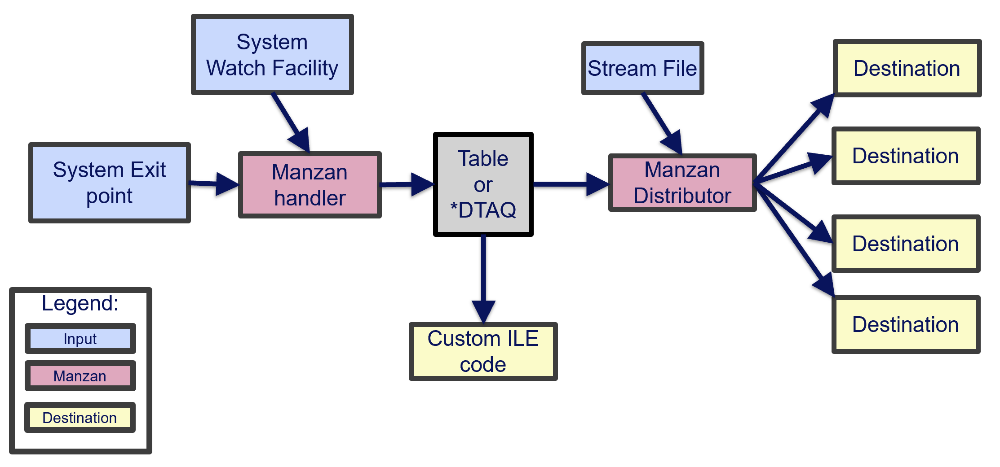
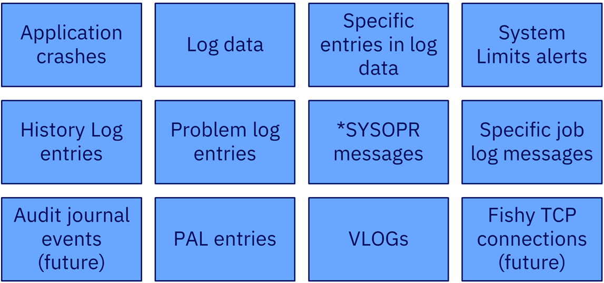
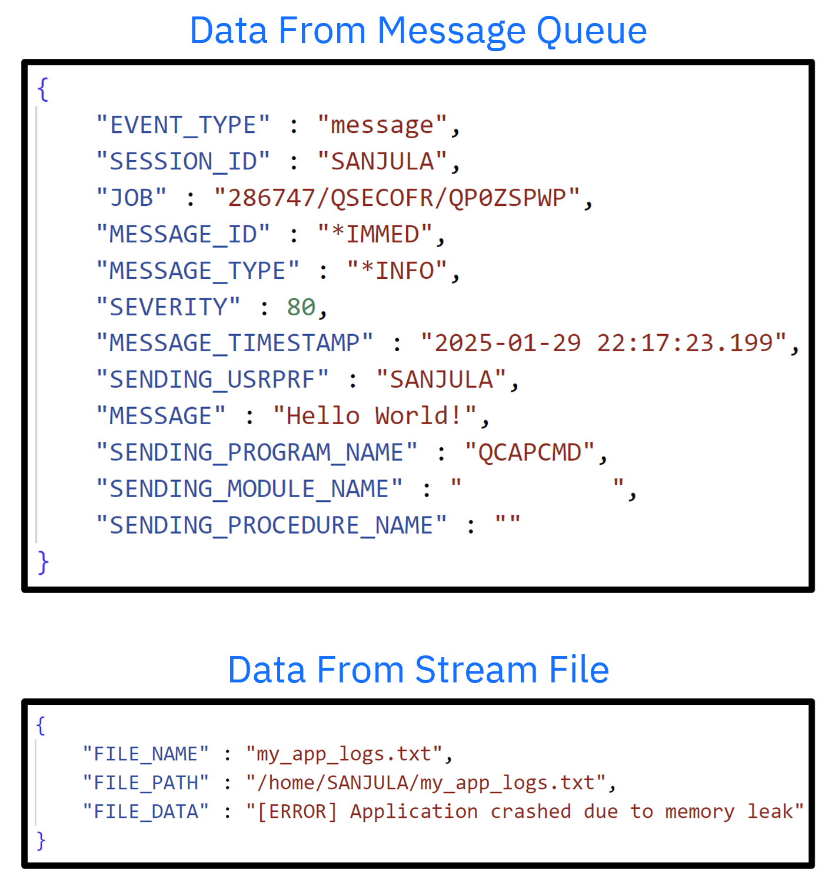
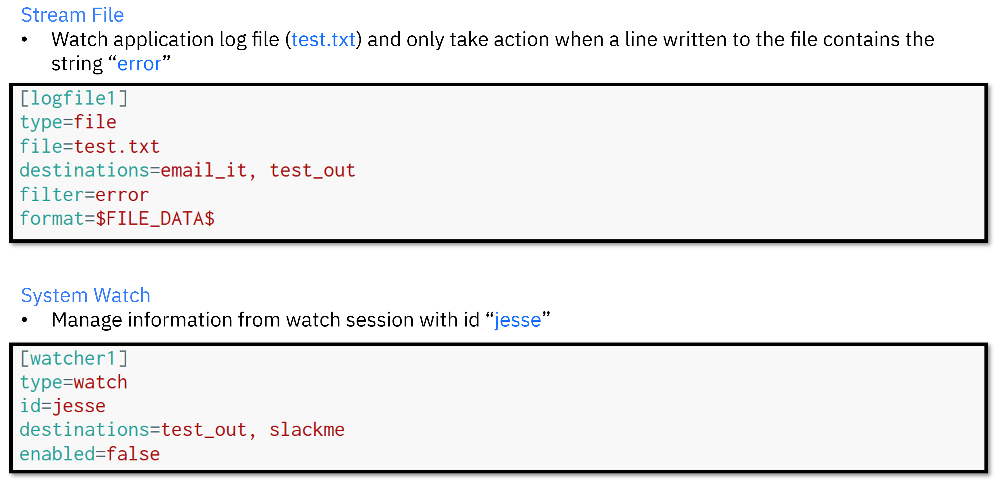
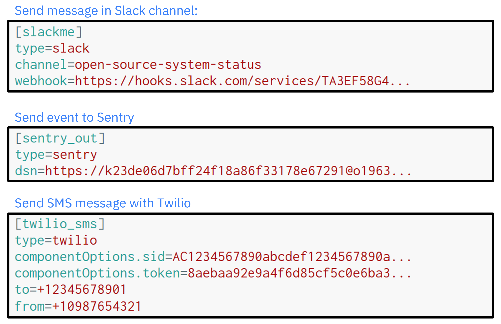
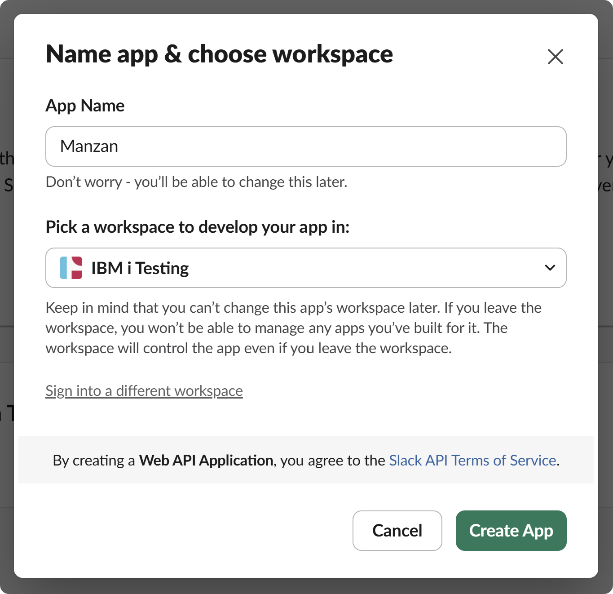
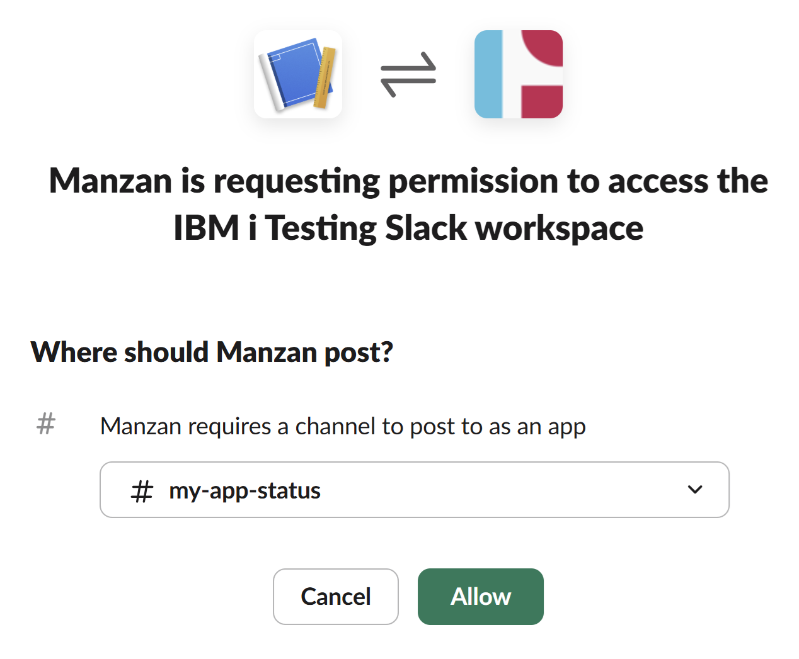
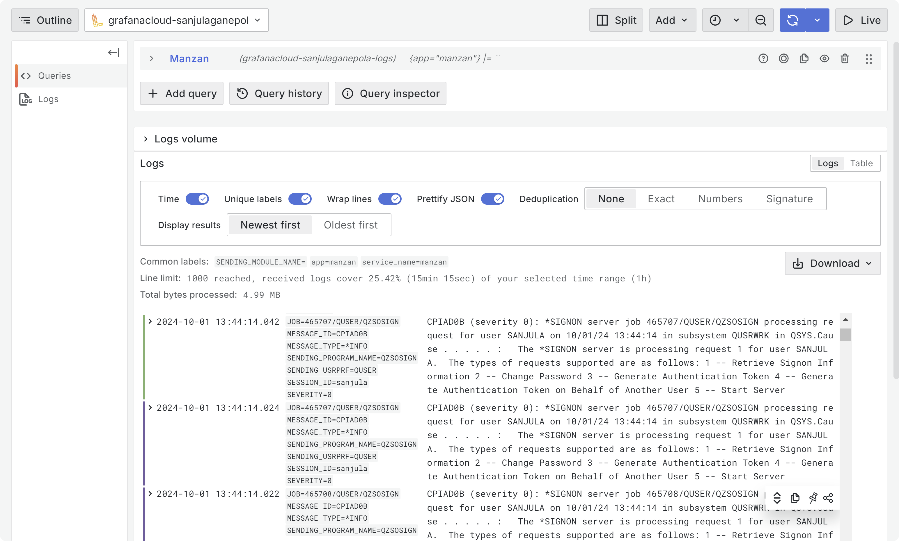
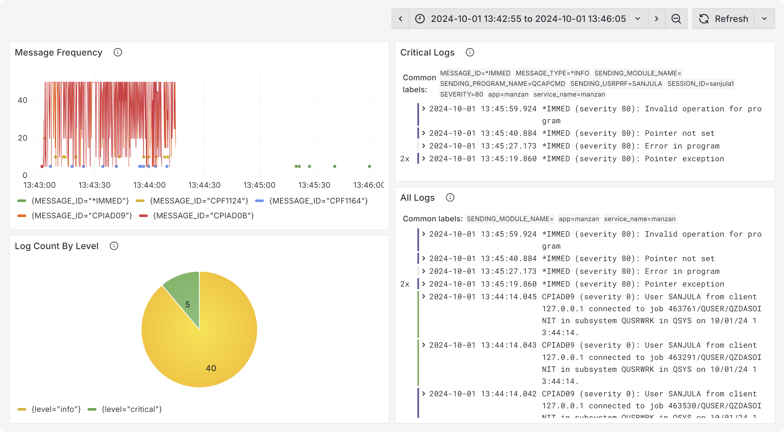

[Manzan](https://theprez.github.io/Manzan/#/) is an open-source project designed to simplify the process of publishing IBM i system events to a wide variety of endpoints such as user applications, external resources, and/or open source technologies. Whether you need to monitor system messages, trigger alerts, or consolidate logs for compliance and reporting, *Manzan* makes it easy to integrate IBM i with the rest of your IT environment.

## Understanding the Architecture



The architecture of *Manzan* is best understood by first exploring two core components: *Inputs* and *Destinations*.

1. *Inputs* are the sources of your data. In its most simplistic form, this could be a stream file which you would like to monitor. However, an *input* can also involve using the system watch facility which is a powerful yet underutilized tool built into the IBM i. This tool uses the [STRWCH](https://www.ibm.com/docs/en/i/7.4?topic=program-starting-watch-session) command to start the watch for event function which calls a specified program when a specified event occurs. This means that your *inputs* can be a message on a message queue, a [Licensed Internal Code (LIC) log entry](https://www.ibm.com/docs/en/power5?topic=tool-licensed-internal-code-lic-log) or a [Product Activity Log (PAL) entry](https://www.ibm.com/docs/en/power5?topic=functions-product-activity-log).

    

2. *Destinations* are the locations you would like to send your data to. One option is to retrieve the data using your own custom ILE code, but in most cases you will want to use one of the [many supported destinations](https://theprez.github.io/Manzan/#/?id=where-can-i-send-these-events) based on your use case:

    * HTTP/HTTPS endpoints (REST, etc)
    * Email (SMTP/SMTPS)
    * SMS (via [Twilio](http://www.twilio.com))
    * [Slack](http://slack.com)
    * [FluentD](http://fluentd.org)
    * [Kafka](http://kafka.apache.org)
    * [Sentry](http://sentry.io)
    * [Grafana Loki](https://grafana.com/oss/loki/)
    * [Google Pub/Sub](http://cloud.google.com/pubsub)
    * [ActiveMQ](http://activemq.apache.org/)

*Manzan* is the gateway that bridges your *inputs* and *destinations*. It itself consists of two core components: *Handler* and *Distributor*.

1. The *handler* is what receives and handles your *inputs* if they are a system watch or exit point event. It does this by first starting all the system watches and then transforming the data into a usable format and lastly placing it on a table or data queue when an event is detected. So how does it know what your *inputs* are? Well, you will define a configuration file (`data.ini`) that contains this information.
2. The *distributor* is what sends your data to its ultimate destination using the power of [Apache Camel](https://camel.apache.org/), the swiss army knife of integration. This component will retrieve data off the table or data queue and then feed that to your chosen *destinations*. Similar to the *handler*, you will define a configuration file (`dests.ini`) that outlines what these *destinations* are.



## Configuring Inputs and Destinations

Configuring *Manzan* is made easy with the help of a few configuration files that will be located in `/QOpenSys/etc/manzan/`. These configuration files each follow an `ini` file format and are structured to make it easy to add and remove both *inputs* and *destinations* in minutes. Rather than having to know different protocols for each new tool that you would like to integrate, you will simply need to update these standard files.

1. `app.ini`: This file will contain some information that specifies the library containing an ILE component necessary for *Manzan* to function. In most cases, this file can remain untouched.
2. `data.ini`: This file will outline your *inputs* in a simple format. These will each have a unique ID and a type assigned based on if you are watching a stream file, message queue, etc. This is where you will also mapping your *inputs* to your *destinations*.

    

3. `dests.ini`: This file will outline your *destinations* also with its own unique ID.  Based on where you would like to send your data, you will need to specify some required properties such as credentials.

    

## Sending Messages to Slack

Slack is an awesome collaboration tool for keeping teams up to date. With *Manzan*, this can include keeping them updated on the status of an application running on IBM i. In this first example, let's take a look at how you can get Slack updates on an IBM i application as it dumps error logs into a stream file.

To be able to send messages into a Slack channel, you will need to first create a Slack app using the following steps:

1. Navigate to the [Slack Apps](https://api.slack.com/apps) website.
2. Click `Create an App` and select `From scratch`.
3. Give your app a name, select a workspace, and click `Create App`.



Next, you will need to create an incoming webhook for your newly create Slack App to post messages into a channel:

1. Navigate to the `Incoming Webhooks` section under the `Features` heading.
2. Toggle the feature on to activate incoming webhooks and click `Add New Webhook to Workspace`.
3. Select the Slack channel you would like to receive updates in and click `Allow`.
4. Copy the generated webhook URL and keep it handy. It will look something like `https://hooks.slack.com/services/...`.



In my case, I created a Slack App named `Manzan`, gave it access to my `IBM i Testing` workspace, and gave it access to a channel named `my-app-status`.

Now that you have a working Slack app, you just need to update the Manzan configuration files for it to start posting messages. Let's start by adding a new *input* to the `data.ini` file:

```ini
[file_my_app]
type=file
file=/tmp/my-app-log.txt
destinations=slack_out
filter=ERROR:
format=$FILE_DATA$
```

So, what exactly did you do here? Well let's pause and review what each of these lines are doing:

* `[file_my_app]`: Assigns `file_my_app` as the unique ID for this *input*.
* `type`: Specifies this *input* to be of type `file` since you want to monitor a stream file.
* `file`: Specifies the path to the file you want to watch. In this case, it is the application's log file.
* `destinations`: Specifies `slack_out` as the *destination* to send this data to. This same ID will be defined into `dests.ini`.
* `filter`: Since you do not want Slack updates for every log message, you can define a filter to only listen for lines that include `ERROR:`.
* `format`: Defines the format in which the data should be sent in. If not specified, all information will be sent. In this case, you are only interested in the log message itself so you can use the special key `$FILE_DATA$` to get back just the file content. All possible keys are listed [here](https://theprez.github.io/Manzan/#/config/data?id=optional-properties-for-all-types).

Now the last step is to add a new *destination* to the `dests.ini` file:

```ini
[slack_out]
type=slack
channel=my-app-status
webhook=https://hooks.slack.com/services/...
```

Again, let's review each of these lines:

* `[slack_out]`: Assigns `slack_out` as the unique ID for this *destination*. This is the same ID you used previously in the `destinations` field of `dests.ini`.
* `type`: Specifies this *destination* to be of type `slack` which is the predefined type for Slack. All possible types are listed [here](https://theprez.github.io/Manzan/#/config/dests?id=available-types).
* `channel`: Specifies the channel which you assigned your Slack app to post in.
* `webhook`: Specifies the webhook URL which you generated earlier.

Now you can go ahead and start up *Manzan* using [Service Commander](https://theprez.github.io/Manzan/#/install?id=deployment-basics). With *Manzan* now running, you can observe that whenever a message is added to the application's log file, it will also post the message in your Slack channel.


In my case, the `Manzan` Slack App posted a message in the `my-app-status` channel when my application logged an error due to failure to start its REST server.

## Ingesting Logs into Grafana Loki

Now that we have gone over a basic example, let's take a look at a more complicated one involving [Grafana Loki](https://grafana.com/oss/loki/). Keep in mind that while this example is more involved  in terms of setting up Grafana Loki, the steps to setup Manzan itself using the same configuration files are exactly the same.

For those who have not heard of Grafana Loki, it is a log aggregation system used for ingesting logs and processing queries. With these application or IT infrastructure logs, Grafana allows you the ability to query and display them using custom designed dashboards. Let's have a look at how you can watch for messages being adding to the `QHST` history log's message queue on IBM i and ingest this data to Grafana Loki.

> The steps below assume you have already created a Grafana Loki instance and have the credentials (`url`, `username`, and `password`) for it on hand.

Just like the previous example, the first step is to add a new *input* to your `data.ini` file:

```ini
[watch_hstlog]
type=watch
id=sanjula
destinations=loki_out
strwch=WCHMSG((*ALL)) WCHMSGQ((*HSTLOG))
format=$MESSAGE_ID$ (severity $SEVERITY$): $MESSAGE$
```

Let's review again what happened here:

* `[watch_hstlog]`: Assigns `watch_hstlog` as the unique ID for this *input*.
* `type`: Specifies this *input* to be of type `watch` since you want to monitor a message queue.
* `id`: Assigns `sanjula` as the session identifier (`SSNID`) for this watch. This identifier must be unique across all active watches on the IBM i.
* `destinations`: Specifies `loki_out` as the *destination* to send this data to. This same ID will be defined into `dests.ini`.
* `strwch`: Specifies additional parameters for the `STRWCH` CL command to describe how the watch should be started when *Manzan* starts up. In this case, you are trying to listen for all messages being added to the history log's message queue.
* `format`: Defines the format in which the data should be sent in. Unlike the previous example, several keys are used here to include more information.

Now that you have an *input* defined, you then need to add a new *destination* to the `dests.ini` file:

```ini
[loki_out]
type=loki
url=<loki_url>
username=<loki_username>
password=<loki_password>
```

Yet again, let's review each of these lines:

* `[loki_out]`: Assigns `loki_out` as the unique ID for this *destination*. This is the same ID you used previously in the `destinations` field of `dests.ini`.
* `type`: Specifies this *destination* to be of type `loki` which is the predefined type for Grafana Loki.
* `url`/`username`/`password`: Specifies the credentials to your Grafana Loki instance.

Now you can start up *Manzan* just like before, but this time observe that whenever a message is added to the history log's message queue, it is also ingested into Grafana Loki.



Now that you have all these aggregated logs, you can design and build your very own dashboard to visualize this information. The example dashboard below can be used by system admins to quickly monitor message frequency and quickly isolate critical logs.

